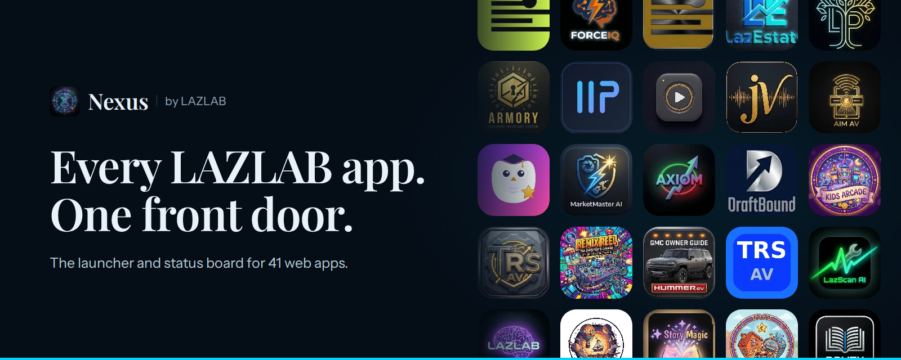

  

# Nexus Suite

The public landing page for **Nexus**, the launcher and status board for every [LAZLAB](https://johnlaz.github.io/lazlab/) app.

**Live:** https://johnlaz.github.io/nexusapp/ &nbsp;|&nbsp; **Open the app:** [`/app`](app/)

## What's here

| Path | What it is |
|------|------------|
| `index.html` | The landing page. One file, no build step. |
| `app/` | The Nexus dashboard itself. See [`app/README.md`](app/README.md). |
| `icons/` | App icons (`<slug>.webp`, 128 px) and PWA icons. |
| `media/` | Dashboard screenshots, PWA manifest screenshots and the social share image. |
| `manifest.json`, `sw.js` | PWA manifest and service worker for the landing page. |

## Updating the app list

The landing page renders from a single `APPS` array at the bottom of `index.html`. To add, remove or reorder an app:

1. Drop a 128 px icon into `icons/` named `<slug>.webp`.
2. Add or edit an entry in `APPS` (`slug`, `name`, `group`, `desc`, `url`).
3. Commit. The counts, category chips and hero grid update on their own.

Set `dev: true` on an entry to show an "In development" tag.

## Deploying

1. Push to `main`.
2. In **Settings → Pages**, deploy from branch `main`, folder `/ (root)`.
3. After a change to `index.html`, bump `CACHE_NAME` in `sw.js` so installed copies refresh.

---

Built by LAZLAB. Plain HTML, CSS and JavaScript.
