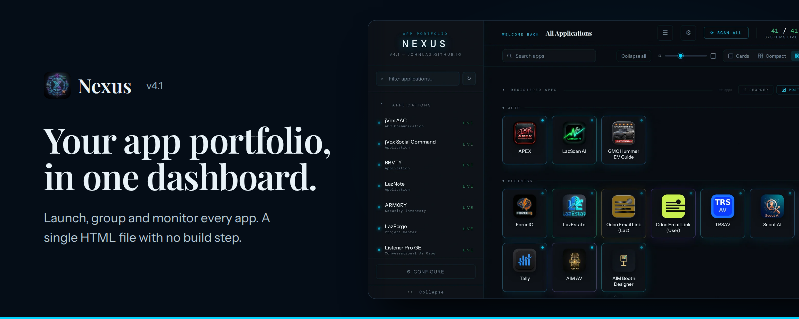

<p align="center">
  
</p>

# Nexus `v4.1`

A dark editorial PWA dashboard for launching, grouping and monitoring a personal suite of web apps. It is a single HTML file with no frameworks, no build tools and no dependencies.

**Live:** https://johnlaz.github.io/nexusapp/app/

---

## Features

### Dashboard
- **Status lights** on every app, checked when Nexus opens, with a live count in the header.
- **Four views:** cards, compact cards, icons or list, with a slider to resize the grid.
- **Pinned strip:** pin favorites for quick launch and press `1` to `9` to open them.
- **Groups:** collapsible categories, plus a **Collapse all** control.
- **Drag to reorder** cards or sidebar items. Order persists between sessions.
- **Search** and a sidebar filter for finding apps fast.

### Sidebar and mobile
- Collapsible sidebar that shrinks to an icon rail on desktop.
- Slide-in drawer and a bottom navigation bar on phones and tablets.

### App configuration
- Per-app name, description, tag, URL, group, icon and optional API key.
- **Scan all** re-reads each app's name, description and theme, optionally tidied by AI. Fields you edit by hand are never overwritten.
- **Local HTML embedding:** upload a `.html` file and run it inside Nexus (no server needed).
- **Groq AI** for enrichment and notes. The model list is fetched from your key, with **Refresh** and **Test** buttons in settings.

### Sharing, export and backup

| Tool | What it does | Safe to share |
|------|--------------|---------------|
| Full Restore | Everything: apps, keys, icons, vault, local HTML, groups, pins and notes | No, personal only |
| Share card | Self-contained `.html` card of your portfolio, with an optional message | Yes |
| Poster | Portfolio poster you can copy as an image or share | Yes |
| Bake and Export | Injects your live app list into a deployable `index.html` | Yes |

### App data vault
- Upload each app's own JSON export and keep it inside Nexus.
- Download any app's file individually to load into that app.
- Included automatically in Full Restore.

---

## Deployment

1. Copy `app/` into your GitHub repo (or just `index.html` for updates).
2. **Settings → Pages → Deploy from branch → main / root.**
3. Bump the cache version in `sw.js` after a release so installed copies refresh.

---

## File structure

```
app/
├── index.html           main app, all logic inline
├── manifest.json        PWA manifest
├── sw.js                service worker
├── banner.png           README banner
├── README.md
├── favicon.ico
├── icon-16.png
├── icon-32.png
├── icon-192.png
├── icon-512.png
└── apple-touch-icon.png
```

---

## Data and privacy

All data lives in your browser's `localStorage`. Nothing is sent to a server except:

- `api.groq.com`, for AI features, only when you trigger them with your own key
- CORS proxies, for metadata scraping when you run **Scan all**
- Google Fonts, for font loading

**Full Restore exports contain API keys and local HTML. Keep them private and do not commit them to GitHub.**

---

## Version history

| Version | Notes |
|---------|-------|
| v4.1 | Current release |
| v4.0 | Editorial redesign, 40+ apps |
| v3.2 | Pinned apps strip, app grouping, simplified import/export menu |
| v3.1 | Full Restore export, mobile 1024 px breakpoint, vault HTML support |
| v3.0 | Local HTML embedding, drag-to-reorder, 20 apps |
| v2.5 | Collapsible sidebar, hardware back intercept, App Data Vault |
| v2.2 | Vault system, debounced save, performance fixes |
| v2.1 | Cyan and purple theme, card glow overhaul |
| v2.0 | 12 apps, Notes, Marketing Card, theme color glows |
| v1.x | Scraping, Groq AI, mobile layout, status monitoring |

---

Built with HTML5, CSS3 and vanilla JavaScript.
